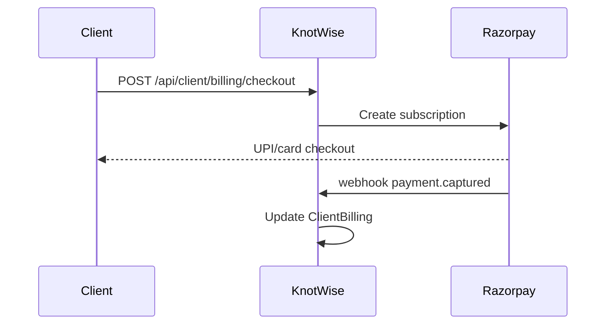

# 16. Payments and Billing

**Project:** KnotWise  
**Version:** 2.0  
**Status:** Approved  
**Phase:** P11

---

## 16.1 Two revenue lines

| Line | Provider | Customer |
|------|----------|----------|
| Bureau SaaS | Stripe (shipped) | Organization |
| Client premium | Razorpay (P11) | End client |

Per [ADR 004](adr/004-payments-primary.md).

---

## 16.2 Bureau SaaS (shipped)

- Stripe Checkout + Customer Portal
- `Subscription` model on org
- Feature gates: seats, customers, emails/month, AI calls
- Routes: `/settings/billing`, `/api/billing/*`, `/api/webhooks/stripe`

---

## 16.3 Client premium tiers (planned)

| Tier | Price (INR/mo) | Features |
|------|----------------|----------|
| Included | 0 | Bureau enrollment |
| Plus | 499 | Priority verification, 2 extra intro requests/mo |
| Premium | 999 | Discovery access P9, profile boost |

Entitlement stored on `ClientBilling.plan`.

---

## 16.4 Razorpay integration

- Webhook: `/api/webhooks/razorpay`
- Idempotency keys on checkout
- GST invoice via Razorpay Invoices

---

## 16.5 Self-serve bureau signup (P11)

- `/signup/bureau` — org name, slug, owner email
- Stripe trial 14 days
- Auto-seed empty org + owner membership

---

## 16.6 Refunds & dunning

- Refund policy: 7-day pro-rata client premium
- Failed payment: 3 retry days → downgrade to Included
- Email notifications via Resend

---

## Scope

Stripe bureau + Razorpay client + self-serve bureau + GST.

## Non-goals

In-app crypto payments.

## Acceptance criteria

- [ ] UPI payment completes in sandbox
- [ ] Webhook updates entitlements within 60s
- [ ] Feature gates enforce plan limits

## Open questions

- Success fee billing model legal review?
