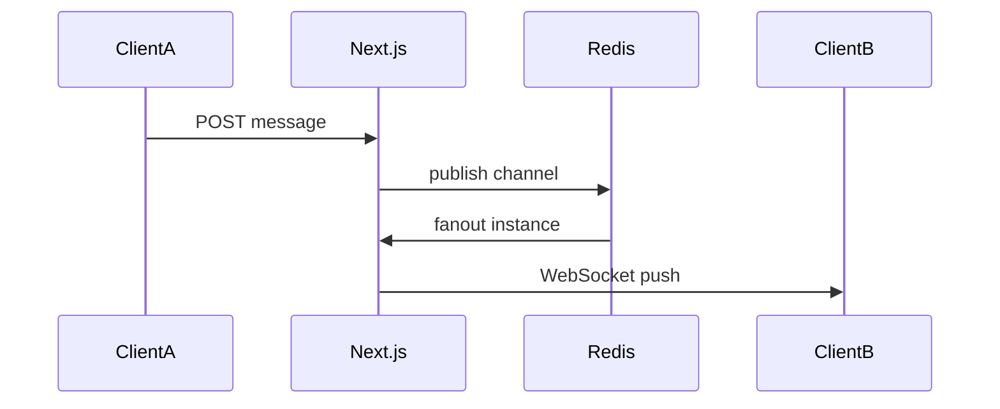

# 17. Realtime and Notifications

**Project:** KnotWise  
**Version:** 2.0  
**Status:** Approved  
**Phases:** P6, P7, P16

---

## 17.1 Messaging architecture

Per [ADR 002](adr/002-c2c-chat.md):

| Phase | C2C transport | Matchmaker thread |
|-------|---------------|-------------------|
| P4 MVP | SSE + REST poll | SSE (existing) |
| P6 | WebSocket (Pusher) + Redis pub/sub | SSE + Pusher |
| P6+ | Redis fanout across instances | Same |

---

## 17.2 Delivery guarantees

| Channel | Guarantee |
|---------|-----------|
| C2C chat | At-least-once; client dedupe by message id |
| Push | Best-effort; retry 3x |
| Email | At-least-once via Inngest |
| SMS OTP | At-least-once; user can resend |

Read receipts: `readAt` on `C2cMessage` when thread opened.

---

## 17.3 Push notifications (P7)

| Trigger | Payload |
|---------|---------|
| New intro | `{ type: "intro", suggestionId }` |
| Mutual match | `{ type: "mutual", mutualMatchId }` |
| C2C message | `{ type: "message", conversationId, preview }` |
| Date reminder | `{ type: "reminder", eventId }` |

Preferences: `NotificationPreference` per client.

---

## 17.4 SMS at scale

- MSG91 for OTP + optional intro SMS
- DLT registered templates
- Opt-out keyword STOP

---

## 17.5 Email at scale (P16)

- Resend production domain + SPF/DKIM
- Webhook bounce/complaint → suppress list
- `EmailLog.deliveryStatus` sync from Resend events

---

## 17.6 Deep links

Email/SMS links use `CLIENT_PORTAL_URL` or app universal links (doc 14).

Magic link TTL: signup 24h; login 15min.

---

## Scope

Realtime C2C, push, SMS/email delivery, bounce handling.

## Acceptance criteria

- [x] C2C realtime delivery via Pusher or SSE (P6)
- [x] Matchmaker thread SSE + optional Pusher (P6)
- [ ] C2C p95 delivery <2s at 1k concurrent (load test P16)
- [ ] Push received on device within 10s (P7)
- [ ] Bounce suppresses future sends (P16)

## Open questions

- Pusher vs Ably cost at 10k MAU?
