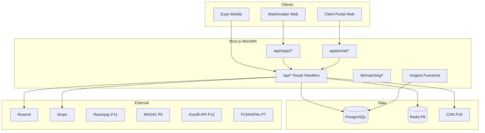

# 2. Technical Requirements Document (TRD)

**Project:** KnotWise  
**Version:** 2.0  
**Status:** Approved  
**Supersedes:** [`archive/v1/2-TRD.md`](archive/v1/2-TRD.md)

### Changelog v2.0

- Stack updated: PostgreSQL required, Resend/Stripe/UploadThing/Inngest
- Added consumer auth, realtime, mobile, ML, security NFRs
- SQLite demoted to historical MVP only

---

## 2.1 Tech stack

| Layer | Choice | Notes |
|-------|--------|-------|
| Framework | Next.js 15 App Router | Monolith + API routes |
| Language | TypeScript strict | Shared `lib/types.ts` |
| UI | Tailwind v4, custom components | Bureau + portal design systems |
| DB | **PostgreSQL** + Prisma | Multi-tenant org model |
| Cache / pub-sub | Redis (P6) | Sessions optional; realtime |
| Auth | iron-session + magic link; OTP P5; Bearer mobile | Separate cookies: matchmaker / client |
| Email | Resend + Inngest | `EMAIL_DRY_RUN` dev |
| Billing | Stripe (bureau) + Razorpay (client P11) | Webhooks |
| Media | UploadThing → CDN (P16) | Multi-photo P2 |
| Jobs | Inngest | Email, ML cron |
| LLM | NVIDIA NIM (OpenAI SDK) | Explanations + email drafts |
| Mobile | Expo monorepo | `apps/mobile`, `@knotwise/api-client` |
| Realtime | SSE → WebSocket P6 | [ADR 002](adr/002-c2c-chat.md) |
| Hosting | Vercel + managed Postgres (Neon/Supabase) | See doc 11 |

---

## 2.2 Architecture

---

## 2.3 Repository layout

See root README. Key additions for consumer v2:

- `app/portal/signup`, `app/portal/onboarding` — P1
- `app/api/client/*` — client APIs
- `lib/profile/completeness.ts` — P1
- Future: `app/api/mutual/*`, `app/api/c2c/*`, `lib/realtime/*`

---

## 2.4 Auth v2

| Actor | Mechanism | Session |
|-------|-----------|---------|
| Matchmaker | Username/password | `knotwise_session` |
| Client | Magic link; OTP P5 | `knotwise_client_session` |
| Mobile | Bearer token | `MobileAuthToken` |
| Family delegate | Magic link + scoped role P10 | Delegate session extension |

Refresh tokens (P8 mobile): JWT 7d + rotate on use.

---

## 2.5 Realtime (P6)

- C2C: WebSocket channels per `Conversation.id`
- Matchmaker thread: SSE acceptable through P5
- Presence: optional `lastSeenAt` on participants

---

## 2.6 Mobile (P8)

- Expo SDK 52+
- SecureStore for tokens
- Deep links: `knotwise://portal/verify?token=`
- Push via Expo Notifications → FCM/APNs

---

## 2.7 Media

- UploadThing → S3-compatible storage
- P2: `Asset` album per customer (max 6 photos, 1 video intro P13)
- P16: CloudFront or Vercel Blob CDN

---

## 2.8 Search (P9)

Postgres FTS per [ADR 005](adr/005-search-engine.md). Indexed columns: gender, city, religion, age, verification tier.

---

## 2.9 ML serving (P12)

- Batch re-rank: existing `lib/matching/ml-rerank.ts`
- Online: optional edge function; default batch on intro send
- Training: weekly Inngest job; `ModelVersion` artifact

---

## 2.10 Observability

- Structured logs (JSON) with `requestId`, `orgId`, `actorId`
- Audit: `AuditEvent` table (retention 7 years P15)
- Error tracking: Sentry (P16)
- Metrics: Vercel Analytics + custom events (doc 13)

---

## 2.11 Security NFRs

| Control | Requirement |
|---------|-------------|
| Rate limit | 100 req/min/IP public; 1000/min authenticated |
| PII encryption | Phone, ID doc URLs encrypted at rest P15 |
| CSRF | SameSite cookies; POST-only mutations |
| IDOR | All customer access via `canAccessCustomer()` |
| Content safety | Profanity filter P5 on chat + bio |

---

## 2.12 Performance SLOs (P16)

| Endpoint | p95 |
|----------|-----|
| Dashboard load | <800ms |
| Match rank (12 candidates) | <2s |
| C2C message send | <500ms |
| Push delivery | <10s |

---

## 2.13 Matching algorithm (baseline)

Gender-aware hybrid rules in `lib/matching/`. v2 extensions in [`15-Matching-Engine-v2.md`](15-Matching-Engine-v2.md).

---

## Acceptance criteria

- [ ] Stack table matches `package.json` and deployed services
- [ ] Every external integration has owner and env var in `.env.example`

## Open questions

- Redis host: Upstash vs ElastiCache?
- Single region (ap-south-1) for India latency?
