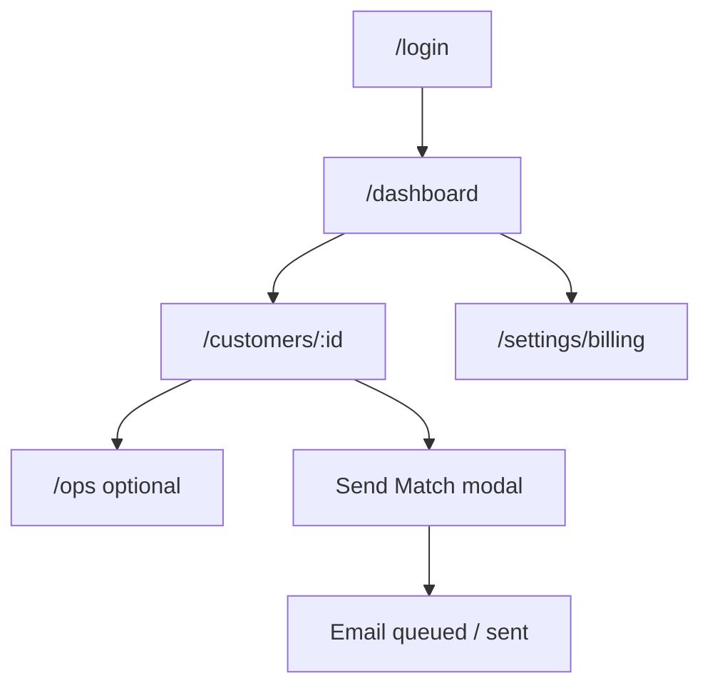
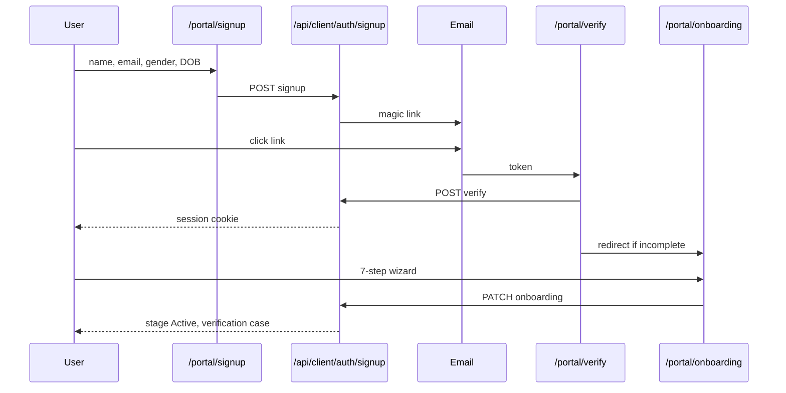
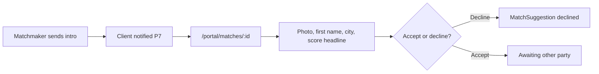
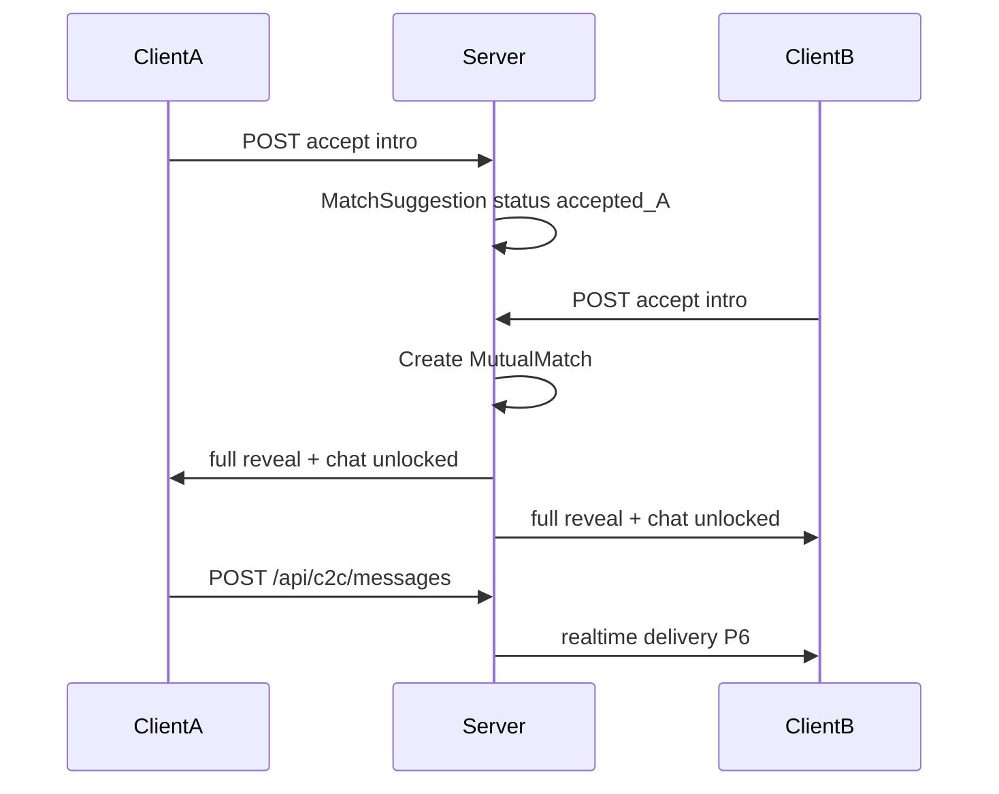
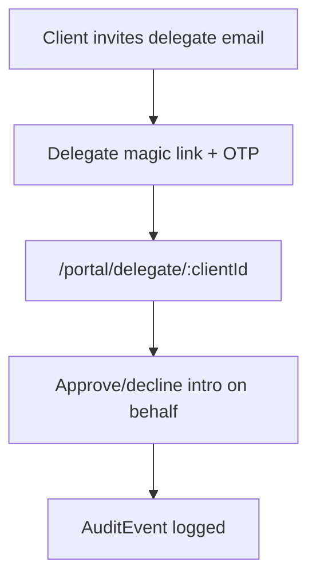
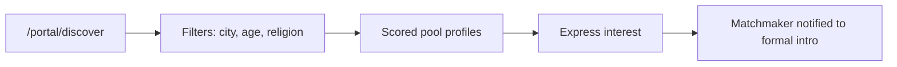
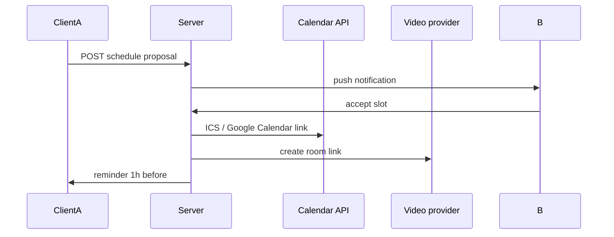
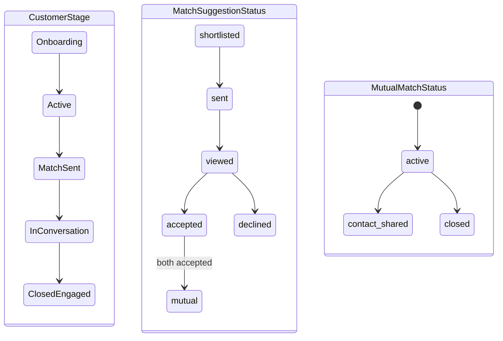

# 3. Application Flow

**Project:** KnotWise  
**Version:** 2.0  
**Status:** Approved  
**Supersedes:** [`archive/v1/3-Application-Flow.md`](archive/v1/3-Application-Flow.md)

### Changelog v2.0

- Part I updated for post-MVP bureau routes
- Part II added: consumer journeys P1–P13
- Global state machine linking Customer, MatchSuggestion, MutualMatch

---

## Part I — Matchmaker bureau

### I.1 Top-level journey (updated)

### I.2 Routes (shipped)

| Route | Purpose |
|-------|---------|
| `/login` | Matchmaker auth |
| `/dashboard` | Customer manifest |
| `/customers/:id` | Dossier: biodata, matches, notes, messages |
| `/ops` | Verification queue, ops dashboard |
| `/settings/billing` | Stripe checkout/portal |

See [`archive/v1/3-Application-Flow.md`](archive/v1/3-Application-Flow.md) for page-level MVP detail (still valid for bureau tabs).

---

## Part II — Consumer portal

### II.1 Signup → verify → onboarding (P1)

**Pages:** `/portal/signup`, `/portal/login`, `/portal/verify`, `/portal/onboarding`  
**APIs:** `POST /api/client/auth/signup`, `POST /api/client/auth/magic-link`, `POST /api/client/auth/verify`, `GET/PATCH /api/client/onboarding`

---

### II.2 Receive intro → limited reveal (P3)

**Limited reveal fields:** firstName, age, city, photo, 2-line bio, compatibility score bucket — no phone, email, company, gotra.

---

### II.3 Mutual unlock → full reveal → C2C (P3 + P4)

Optional contact share: client toggles "Share my phone" after mutual.

---

### II.4 Family delegate (P10)

See [ADR 007](adr/007-family-delegate-model.md).

---

### II.5 Discovery feed (P9, optional)

Hybrid: express interest does **not** auto-open C2C; matchmaker may send formal intro.

---

### II.6 Push & deep links (P7)

| Event | Deep link |
|-------|-----------|
| New intro | `knotwise://portal/matches/:id` |
| New C2C message | `knotwise://portal/chat/:conversationId` |
| Verification approved | `knotwise://portal/profile` |

---

### II.7 Video & scheduling (P13)

---

### II.8 Profile self-edit (P2)

`/portal/profile/edit` — section tabs; sensitive fields → moderation queue.

---

## Global state machine

| Entity | Field | Values |
|--------|-------|--------|
| Customer | `stage` | Onboarding, Active, Match Sent, In Conversation, Paused, Closed * |
| MatchSuggestion | `status` | shortlisted, sent, viewed, accepted, declined, mutual |
| MutualMatch | `status` | active, contact_shared, closed |

---

## Error & empty states (consumer)

| Screen | Empty | Error |
|--------|-------|-------|
| Onboarding | n/a | "Could not save. Retry." |
| Matches | "No introductions yet." | "Could not load." |
| C2C chat | "Say hello." | "Message failed." |
| Discover P9 | "No profiles match filters." | "Search unavailable." |

---

## Acceptance criteria

- [ ] Every P1–P13 journey has mermaid diagram in this doc
- [ ] State machine matches Schema §global

## Open questions

- Auto-transition Customer.stage on mutual vs manual matchmaker update?
