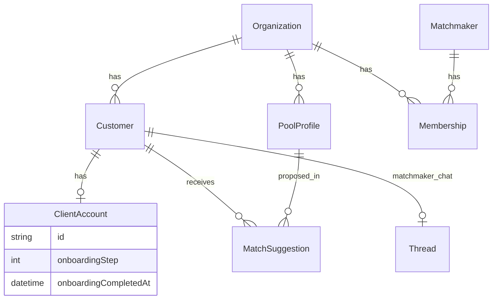

# 4. Backend Schema

**Project:** KnotWise  
**Version:** 2.0  
**Status:** Approved  
**Supersedes:** [`archive/v1/4-Backend-Schema.md`](archive/v1/4-Backend-Schema.md)

### Changelog v2.0

- Documented post-MVP PostgreSQL schema (shipped)
- P1 fields on `ClientAccount` (shipped)
- Prisma deltas for P2–P16 (planned)

---

## 4.1 Current ER (shipped)



Canonical source: [`prisma/schema.prisma`](../prisma/schema.prisma)

### Shipped models (summary)

| Model | Purpose |
|-------|---------|
| Organization, Membership, Matchmaker | Multi-tenant RBAC |
| Customer, PoolProfile | Clients and candidate pool |
| MatchSuggestion, EmailLog | Intros and delivery |
| ClientAccount, MagicLinkToken | Client auth + P1 onboarding |
| Thread, ThreadMessage | Matchmaker↔client chat |
| VerificationCase, VerificationDocument | Ops verification |
| Subscription, ClientBilling | Billing hooks |
| Handoff, Notification, AuditEvent | Collaboration + audit |
| Asset, OrgMatchingConfig, ModelVersion | Media + ML |

---

## 4.2 P1 delta (shipped)

```prisma
model ClientAccount {
  onboardingStep          Int       @default(0)
  onboardingCompletedAt   DateTime?
}
```

Migration: `20260623180000_client_onboarding`

---

## 4.3 P2 — Profile self-service

```prisma
model ProfileRevision {
  id         String   @id @default(cuid())
  customerId String
  fieldPath  String
  oldValue   String
  newValue   String
  status     String   @default("pending")
  reviewedBy String?
  createdAt  DateTime @default(now())
  resolvedAt DateTime?

  customer Customer @relation(fields: [customerId], references: [id], onDelete: Cascade)

  @@index([customerId, status])
}
```

Migration: `20260623200000_profile_self_service`

Extend `Asset`: `kind` default `photo`; max 6 photos per customer via portal gallery.

---

## 4.4 P3 — Mutual intro

```prisma
model MutualMatch {
  id                String   @id @default(cuid())
  matchSuggestionId String   @unique
  clientAId         String
  clientBId         String
  status            String   @default("active")
  contactSharedAt   DateTime?
  createdAt         DateTime @default(now())

  matchSuggestion MatchSuggestion @relation(fields: [matchSuggestionId], references: [id])

  @@index([clientAId])
  @@index([clientBId])
}
```

Extend `MatchSuggestion.status`: add `viewed`, `accepted`, `declined`, `mutual`.

Migration: `20260623210000_mutual_intro`

---

## 4.5 P4 — C2C chat

```prisma
model Conversation {
  id             String   @id @default(cuid())
  mutualMatchId  String   @unique
  createdAt      DateTime @default(now())

  mutualMatch MutualMatch @relation(fields: [mutualMatchId], references: [id])
  messages    C2cMessage[]
  participants ConversationParticipant[]
}

model C2cMessage {
  id             String   @id @default(cuid())
  conversationId String
  senderId       String
  body           String
  createdAt      DateTime @default(now())
  readAt         DateTime?

  conversation Conversation @relation(fields: [conversationId], references: [id])

  @@index([conversationId, createdAt])
}
```

Separate from matchmaker `Thread` — do not merge.

Migration: `20260623220000_c2c_chat`

---

## 4.6 P5 — Trust & safety

```prisma
model VerificationAttempt {
  id         String   @id @default(cuid())
  clientId   String
  channel    String
  target     String
  codeHash   String
  expiresAt  DateTime
  verifiedAt DateTime?
  createdAt  DateTime @default(now())

  @@index([target, channel])
}

model Report {
  id          String   @id @default(cuid())
  reporterId  String
  targetType  String
  targetId    String
  reason      String
  status      String   @default("open")
  createdAt   DateTime @default(now())
}

model Block {
  id        String   @id @default(cuid())
  blockerId String
  blockedId String
  createdAt DateTime @default(now())

  @@unique([blockerId, blockedId])
}
```

Add `Customer.verificationTier`: `unverified | pending | verified | premium`.

Migration: `20260623230000_trust_verification`

---

## 4.8 P8 — Mobile client auth

```prisma
model ClientMobileAuthToken {
  id        String    @id @default(cuid())
  clientId  String
  tokenHash String    @unique
  expiresAt DateTime
  createdAt DateTime  @default(now())
  revokedAt DateTime?
}
```

Migration: `20260623250000_client_mobile_auth`

Bearer tokens validated in `requireApiClientSession()` via `Authorization` header.

---

```prisma
model DeviceToken {
  id        String   @id @default(cuid())
  clientId  String
  platform  String
  token     String   @unique
  createdAt DateTime @default(now())
}

model NotificationPreference {
  id           String  @id @default(cuid())
  clientId     String  @unique
  introPush    Boolean @default(true)
  messagePush  Boolean @default(true)
  reminderPush Boolean @default(true)
}
```

---

## 4.8 P10 — Family delegates (shipped)

```prisma
model FamilyDelegate {
  id              String    @id @default(cuid())
  customerId      String
  email           String
  role            String
  status          String    @default("invited")
  invitedAt       DateTime  @default(now())
  acceptedAt      DateTime?
  revokedAt       DateTime?
  inviteTokenHash String?

  @@unique([customerId, email])
}

model ClientAccount {
  delegateApproverOptIn Boolean @default(false)
}
```

Delegate magic-link and mobile Bearer tokens: `DelegateMagicLinkToken`, `DelegateAuthToken`.

---

## 4.9 P12 — Astro / Kundli (shipped)

```prisma
model AstroProfile {
  id         String    @id @default(cuid())
  entityType String
  entityId   String
  birthTime  String?
  birthPlace String?
  consentAt  DateTime?
  kundliJson String?
  fetchedAt  DateTime?

  @@unique([entityType, entityId])
}

model OrgMatchingConfig {
  kundliEnabled     Boolean @default(false)
  weightPreset      String  @default("v1")
  experimentVariant String  @default("control")
}

model PreferenceSignal { ... }
model MatchExperiment { ... }
```

---

## 4.10 P13 — Scheduling (shipped)

```prisma
model ScheduledEvent {
  id             String    @id @default(cuid())
  mutualMatchId  String
  proposedById   String
  startsAt       DateTime
  endsAt         DateTime?
  mode           String    @default("video")
  title          String?
  location       String?
  status         String    @default("proposed")
  videoLink      String?
  videoRoomId    String?
  videoProvider  String?
  reminderSentAt DateTime?
  respondedAt    DateTime?
  createdAt      DateTime  @default(now())
  updatedAt      DateTime  @updatedAt
}
```

Migration: `20260623300000_scheduling`

---

## 4.11 P14 — Analytics & CRM (shipped)

```prisma
model AnalyticsEvent {
  id         String   @id @default(cuid())
  orgId      String
  eventName  String
  customerId String?
  entityType String?
  entityId   String?
  properties String   @default("{}")
  createdAt  DateTime @default(now())
}

model CrmLead {
  id             String    @id @default(cuid())
  orgId          String
  customerId     String    @unique
  stage          String    @default("lead")
  priority       String    @default("normal")
  source         String    @default("signup")
  notes          String?
  lastContactAt  DateTime?
  nextFollowUpAt DateTime?
  assigneeId     String?
  createdAt      DateTime  @default(now())
  updatedAt      DateTime  @updatedAt
}
```

Migration: `20260623310000_analytics_crm`

---

## 4.12 P9 — Discovery

```prisma
model DiscoveryInterest {
  id            String   @id @default(cuid())
  customerId    String
  poolProfileId String
  status        String   @default("pending")
  note          String?
  createdAt     DateTime @default(now())

  @@unique([customerId, poolProfileId])
}
```

`PoolProfile.searchText` — denormalized text for Postgres FTS (`gin(to_tsvector(...))`).  
`OrgMatchingConfig.discoveryEnabled`, `discoveryDailyLimit`.

Migration: `20260623260000_discovery`

---

## 4.12 API types

Shared biodata: [`lib/types.ts`](../lib/types.ts) — `Biodata`, `PartnerPreferences`, `Stage`.

Profile completeness: [`lib/profile/completeness.ts`](../lib/profile/completeness.ts)

---

## 4.13 Migration path

1. MVP SQLite → Post-MVP Postgres (done)
2. P1 onboarding columns (done)
3. P3 `MutualMatch` before P4 C2C
4. P5 verification before premium badges
5. No breaking changes to `biodata` JSON — extend fields in place

---

## Acceptance criteria

- [ ] Every new P2–P16 entity has migration name and PRD cross-link
- [ ] ER diagram updated when P3 ships

## Open questions

- Soft-delete customers vs hard delete for DPDP?
