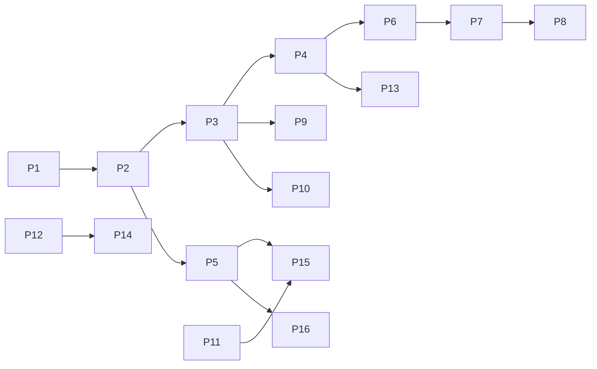

# 5. Implementation Plan

**Project:** KnotWise  
**Version:** 2.0  
**Status:** Approved  
**Supersedes:** [`archive/v1/5-Implementation-Plan.md`](archive/v1/5-Implementation-Plan.md)

### Changelog v2.0

- MVP phases 1–7 marked complete (archived detail)
- Post-MVP phases 8–20 marked shipped
- Consumer P1–P16 added with dependencies

---

## 5.1 MVP phases 1–7 (complete)

See [`archive/v1/5-Implementation-Plan.md`](archive/v1/5-Implementation-Plan.md). All checkboxes complete.

**Done when:** Demo script login → send match works. ✅

---

## 5.2 Post-MVP bureau phases 8–20 (shipped)

| Phase | Goal | Status | Key paths |
|-------|------|--------|-----------|
| 8 | PostgreSQL + org model | ✅ | `prisma/migrations/20260623150000_post_mvp/` |
| 9 | Client portal + magic link | ✅ | `app/portal/`, `app/api/client/auth/` |
| 10 | Resend email + Inngest | ✅ | `lib/email/`, `lib/inngest/` |
| 11 | Stripe billing hooks | ✅ | `lib/billing/`, `app/api/billing/` |
| 12 | Handoffs, @mentions, ops | ✅ | `app/(app)/ops/`, `Handoff` |
| 13 | Verification queue | ✅ | `VerificationCase` |
| 14 | Matchmaker↔client chat | ✅ | `Thread`, `app/api/client/messages` |
| 15 | UploadThing photos | ✅ | `app/api/uploadthing/` |
| 16 | Bulk shortlist | ✅ | `app/api/customers/[id]/shortlist/bulk/` |
| 17 | ML re-rank hooks | ✅ | `lib/matching/ml-rerank.ts` |
| 18 | Expo mobile scaffold | ✅ | `apps/mobile/` |
| 19 | MVP gap fixes | ✅ | `candidate-drawer.tsx`, ops dashboard |
| 20 | Middleware + audit | ✅ | `middleware.ts`, `lib/audit.ts` |

---

## 5.3 Consumer phases P1–P16

### Dependency graph

---

### P1 — Client onboarding v2 | **Shipped**

| | |
|---|---|
| **Goal** | Self-signup + wizard + completeness |
| **Depends on** | Post-MVP portal |
| **Effort** | ~1 week |
| **Demo** | Signup → verify → onboarding → portal home |

**Checklist**

- [x] `POST /api/client/auth/signup`
- [x] `GET/PATCH /api/client/onboarding`
- [x] `/portal/signup`, `/portal/onboarding`
- [x] `ClientAccount.onboardingStep`, `onboardingCompletedAt`
- [x] Profile completeness scoring
- [x] UploadThing in onboarding wizard
- [x] Step validation per wizard step
- [x] Phone format validation (OTP deferred to P5)
- [ ] Onboarding analytics events (P14)

**Done when:** New user completes signup → 80% profile → Active stage without matchmaker manual create.

---

### P2 — Profile self-service | Shipped

| | |
|---|---|
| **Goal** | Direct edit + moderation queue + multi-photo |
| **Depends on** | P1 |
| **Effort** | ~1.5 weeks |
| **Demo** | Edit bio live; photo change queued for ops |

**Checklist:** `ProfileRevision` model; `/portal/profile/edit`; ops approve UI; 6-photo album.

**Done when:** Client edits non-sensitive fields instantly; sensitive fields require ops approve within 48h SLA.

---

### P3 — Mutual intro machine | Shipped

| | |
|---|---|
| **Goal** | Limited reveal → accept/decline → mutual unlock |
| **Depends on** | P2 |
| **Effort** | ~2 weeks |
| **Demo** | Two test clients accept same intro → mutual |

**Checklist:** `MutualMatch`; extend `MatchSuggestion.status`; limited reveal API; portal match detail UI.

**Done when:** Contact fields hidden until mutual; audit log records both acceptances.

---

### P4 — C2C chat | Shipped

| | |
|---|---|
| **Goal** | Messaging post-mutual |
| **Depends on** | P3 |
| **Effort** | ~2 weeks |
| **Demo** | Mutual clients exchange messages in portal |

**Checklist:** `Conversation`, `C2cMessage`; `/api/c2c/*`; portal chat UI; block hook.

**Done when:** Messages persist; blocked user cannot send.

---

### P5 — Trust & verification prod | Shipped

| | |
|---|---|
| **Goal** | OTP, KYC, photo review, gotra rules |
| **Depends on** | P2 |
| **Effort** | ~3 weeks |

**Checklist:** MSG91 integration; ID upload; verification tiers; gotra filter in rank; report/block.

---

### P6 — Realtime infra | **Shipped**

| | |
|---|---|
| **Goal** | WebSocket + Redis |
| **Depends on** | P4 |
| **Effort** | ~1.5 weeks |

**Checklist**

- [x] Pusher private channels + auth (`/api/realtime/pusher/auth`)
- [x] Redis pub/sub fanout (`lib/realtime/redis.ts`)
- [x] SSE fallback for dev (`memory-sse`, `redis-sse`)
- [x] C2C dispatch on message create (`dispatchC2cEvent`)
- [x] Matchmaker thread SSE + Pusher (`/api/client/messages/stream`)
- [x] Client hooks (`use-c2c-realtime`, `use-thread-realtime`)
- [x] Docker Redis service
- [x] Poll fallback when no infra in production

**Done when:** C2C messages appear without 4s poll in dev; Pusher path ready for production keys.

---

### P7 — Push notifications | **Shipped**

| | |
|---|---|
| **Goal** | FCM/APNs + preferences |
| **Depends on** | P6 |
| **Effort** | ~1 week |

**Checklist**

- [x] `DeviceToken` + `NotificationPreference` models
- [x] Expo push sender with 3x retry (`lib/push/expo.ts`)
- [x] `POST/GET/DELETE /api/client/devices`
- [x] `GET/PATCH /api/client/notifications/preferences`
- [x] Triggers: intro sent, mutual match, C2C message, reminder hook
- [x] Deep links in push payload (`url`, `deepLink`)
- [x] Portal `/portal/settings/notifications`
- [x] Mobile registration helper (`apps/mobile/lib/push.ts`)
- [x] `PUSH_DRY_RUN` for local dev

**Done when:** Client can opt out per category; push fires on intro/mutual/message events.

---

### P8 — Mobile app v1 | **Shipped**

| | |
|---|---|
| **Goal** | Store-ready Expo |
| **Depends on** | P7 |
| **Effort** | ~4 weeks |

**Checklist**

- [x] Client bearer auth (`POST/GET/DELETE /api/client/auth/token`)
- [x] Magic link login + SecureStore session
- [x] Tab navigation: Home, Intros, Chat, Profile
- [x] Intro list/detail with accept/decline
- [x] C2C chat list + conversation
- [x] Onboarding, profile edit, matchmaker messages
- [x] Notification preferences screen
- [x] Push registration + deep link handling
- [x] EAS `preview` + `production` profiles
- [x] Expanded `@knotwise/api-client` client API

**Done when:** Login → intro → mutual → chat works on device via Expo.

---

### P9 — Discovery (optional) | **Shipped**

| | |
|---|---|
| **Goal** | Browse/search pool |
| **Depends on** | P3 |
| **Effort** | ~2 weeks |

**Checklist**

- [x] `DiscoveryInterest` model + daily rate limit
- [x] Postgres FTS index on `PoolProfile.searchText`
- [x] `GET /api/client/discover` with filters + ranked limited reveal
- [x] `POST /api/client/discover/[poolProfileId]/interest` → matchmaker notification
- [x] Exclude introduced, blocked, and self profiles
- [x] Verified profile score boost
- [x] Portal `/portal/discover`
- [x] Mobile Discover tab
- [x] Org `discoveryEnabled` + `discoveryDailyLimit` config

**Done when:** Client browses pool, expresses interest, matchmaker gets notified; no direct C2C.

---

### P10 — Family delegates | **Shipped**

| | |
|---|---|
| **Goal** | Guardian accounts |
| **Depends on** | P3 |
| **Effort** | ~2 weeks |

**Checklist**

- [x] `FamilyDelegate` + `DelegateMagicLinkToken` + `DelegateAuthToken`
- [x] `ClientAccount.delegateApproverOptIn` for approver age rule
- [x] `POST/GET/DELETE /api/family/delegates` + settings + accept
- [x] Delegate auth (magic link + Bearer) + `/api/family/delegate/*`
- [x] Observer vs approver permission matrix ([ADR 007](adr/007-family-delegate-model.md))
- [x] Delegate intro feedback with `actorType: delegate` audit
- [x] Portal `/portal/family` + `/portal/delegate`
- [x] Mobile family delegate management screen
- [x] Max 3 delegates; limited reveal until mutual contact share

**Done when:** Client invites delegate; delegate views intros; approver can accept/decline; actions audited.

---

### P11 — Payments India | **Shipped**

| | |
|---|---|
| **Goal** | Razorpay client premium + bureau self-serve |
| **Depends on** | P2 |
| **Effort** | ~2 weeks |

**Checklist**

- [x] Extended `ClientBilling` with Razorpay fields + GSTIN
- [x] Plus / Premium tiers with feature gates ([doc 16](16-Payments-Billing.md))
- [x] `POST /api/client/billing/checkout` + dry-run UPI sandbox
- [x] `/api/webhooks/razorpay` with idempotent event processing
- [x] GST invoice records on `ClientBillingInvoice`
- [x] Discovery gated to Premium; intro requests for Plus/Premium
- [x] Priority verification queue for paid plans
- [x] `/portal/billing` + mobile premium screen
- [x] `/signup/bureau` self-serve with 14-day trial + optional Stripe checkout

**Done when:** Client upgrades via Razorpay (or dry-run); webhooks update entitlements; bureau can self-register.

---

### P12 — Matching v2 + Kundli | **Shipped**

| | |
|---|---|
| **Goal** | Astro + ML production + A/B |
| **Depends on** | P5 |
| **Effort** | ~4 weeks |

**Checklist**

- [x] `AstroProfile` + client `/portal/astro` with consent + dry-run Kundli
- [x] Matching v2 weights (`lib/matching/v2/*`) with relocation scoring
- [x] Kundli score component (15%, off by default via `kundliEnabled`)
- [x] `PreferenceSignal` + client view/open tracking
- [x] `MatchExperiment` A/B (`control` vs `treatment` weight presets)
- [x] Bias audit by religion/caste/city tier with alerts
- [x] Ops matching config API + dashboard controls
- [x] ML train promotes `weightPreset: v2`

**Done when:** Bureau toggles Kundli; v2 ranking used in treatment experiment; bias report surfaces in ops.

---

### P13 — Scheduling & video | **Shipped**

| | |
|---|---|
| **Goal** | Dates + video links |
| **Depends on** | P4 |
| **Effort** | ~2 weeks |

**Checklist**

- [x] `ScheduledEvent` model + migration
- [x] `GET/POST /api/client/schedules` + `PATCH /api/client/schedules/[id]`
- [x] ICS calendar export (`GET /api/client/schedules/[id]/ics`)
- [x] Daily.co video rooms with `VIDEO_DRY_RUN` default
- [x] Push + email on propose/accept; 1h reminder via Inngest cron
- [x] Portal `/portal/schedule`, `/portal/reminders/[id]`, chat embed
- [x] Mobile Dates tab + deep links

**Done when:** Mutual clients propose/accept dates; video link on accept; reminders fire 1h before.

---

### P14 — Analytics & ops CRM | Spec

| | |
|---|---|
| **Goal** | Funnels + CRM + import/export |
| **Depends on** | P12 |
| **Effort** | ~3 weeks |

**Checklist:** See [`13-Analytics-Metrics.md`](13-Analytics-Metrics.md).

---

### P15 — Compliance hardening | Spec

| | |
|---|---|
| **Goal** | Legal + export/delete + DPDP |
| **Depends on** | P5, P11 |
| **Effort** | ~2 weeks |

**Checklist:** See [`10-Compliance-Legal.md`](10-Compliance-Legal.md).

---

### P16 — Production scale | Spec

| | |
|---|---|
| **Goal** | CDN, monitoring, rate limits |
| **Depends on** | P5 |
| **Effort** | ~2 weeks |

**Checklist:** See [`11-Infrastructure-Deployment.md`](11-Infrastructure-Deployment.md).

---

## 5.4 Project-level Definition of Done (consumer v2)

- [ ] P1–P8 complete for "real dating app" public beta
- [ ] P5 + P15 complete for production India launch
- [ ] All phases have Approved PRD + Flow + Schema + API slices

---

## 5.5 Risk register (v2)

| Risk | Mitigation |
|------|------------|
| Scope creep into pure dating | ADR 001 hybrid guardrails |
| Kundli vendor lock-in | Abstract `AstroProfile`; cache locally |
| Razorpay + Stripe dual reconciliation | Unified entitlement layer in code |
| C2C abuse | P5 report/block before P4 public beta |
