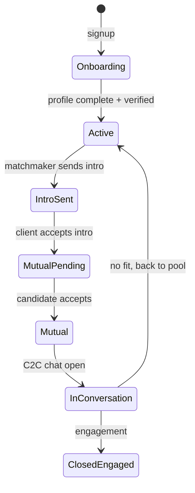

# 7. Glossary and Personas

**Project:** KnotWise  
**Version:** 2.0  
**Status:** Approved  
**Companion to:** [`0-Product-Vision.md`](0-Product-Vision.md), [`1-PRD.md`](1-PRD.md)

---

## 7.1 Glossary

| Term | Definition |
|------|------------|
| **Bureau** | A matchmaking organization using KnotWise (e.g. TDC Matchmaker Bureau) |
| **Org** | Multi-tenant `Organization` record; one bureau = one org |
| **Matchmaker** | Curator with assigned clients; primary user of the console |
| **Ops** | Operations role; verification queue, all-org visibility, handoffs |
| **Client** | Paying or enrolled customer seeking a match; has `Customer` + `ClientAccount` |
| **Candidate** | Person in the verified **pool** (`PoolProfile`) proposed to a client |
| **Pool profile** | Verified biodata in the shared org pool; opposite-gender filter for ranking |
| **Intro** | Matchmaker-sent introduction of a candidate to a client (`MatchSuggestion` status `sent`) |
| **Mutual match** | Both client and candidate (or their delegates) accepted the intro (`MutualMatch`) |
| **Limited reveal** | Pre-mutual profile view: photo, first name, city, headline fields only |
| **Full reveal** | Post-mutual: contact details, full biodata, C2C chat unlock |
| **Family delegate** | Guardian (often parent) with scoped access to review/approve on behalf of client |
| **Verification tier** | `unverified` → `pending` → `verified` → `premium verified` |
| **Journey stage** | Client lifecycle: Onboarding → Active → Match Sent → In Conversation → Closed |
| **Profile completeness** | 0–100% score driving onboarding nudges (P1) |

---

## 7.2 Personas

### Riya — Matchmaker (primary)

- 28, Mumbai, ~50 active clients
- Power user of spreadsheets; wants speed and defensible recommendations
- **Jobs:** Triage by stage, rank pool, send intros, notes, hand off to colleague
- **Pain today:** Too many tabs; no client self-serve; re-sends same profile by mistake

### Arjun — Ops lead (secondary)

- Audits match quality, manages verification queue, reports to leadership
- **Jobs:** Approve profiles, resolve reports, tune org matching config
- **Pain today:** No funnel metrics; verification is manual checklist

### Aanya — Client (consumer)

- 29, Bangalore, software engineer, Never Married
- Enrolled via bureau referral or self-signup (P1)
- **Jobs:** Complete profile, review curated intros, accept/decline, chat after mutual
- **Pain today:** Waits on matchmaker for every profile change; no visibility into pipeline

### Aanya's mother — Family delegate (P10)

- 58, wants visibility and veto/approve on shortlisted intros
- **Jobs:** Review limited reveals, discuss with daughter, approve or decline
- **Constraint:** Must not see full contact until mutual + client consent

### Vikram — Matched candidate (pool-side client)

- 31, Hyderabad; also a **client** in the system (symmetric product)
- Receives intro about Aanya; accepts/declines from his portal
- **Jobs:** Same as Aanya for inbound intros

---

## 7.3 Permission matrix preview

Who sees what at each stage (simplified; full matrix in [`9-Trust-and-Safety.md`](9-Trust-and-Safety.md)).

| Data | Matchmaker | Client (self) | Other client (pre-mutual) | Family delegate | Ops |
|------|------------|---------------|---------------------------|-----------------|-----|
| Full client biodata | Yes (assigned) | Yes | No | Limited (P10) | Yes |
| Pool candidate full biodata | Yes | No (limited reveal only) | N/A | Limited | Yes |
| Intro draft email | Yes | No | No | No | Audit only |
| Contact phone/email | Yes | Own only | After mutual | After mutual + consent | Yes |
| C2C chat | No (separate MM thread) | After mutual | After mutual | Read-only option | Moderation |
| Gotra / sub-caste | Yes | Yes (own) | After mutual or hidden | Limited | Yes |

### Stage progression

---

## 7.4 Acceptance criteria

- [ ] All terms in PRD P1–P16 link back to glossary entries
- [ ] Permission matrix updated when P3, P4, P10 ship

## 7.5 Open questions

- Should delegates see chat transcripts or only intro decisions?
- Minimum age for delegate accounts (18+ vs linked to client)?
