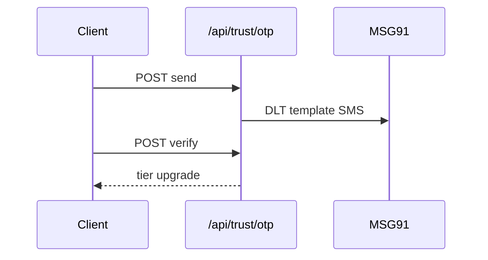

# 9. Trust and Safety

**Project:** KnotWise  
**Version:** 2.0  
**Status:** Approved  
**Phase:** P5 (primary)

---

## 9.1 Verification tiers

| Tier | Requirements | Client-visible |
|------|--------------|----------------|
| unverified | Signup only | None |
| pending | Profile complete, docs submitted | "Under review" |
| verified | Phone OTP + ops ID review | Badge |
| premium | Photo AI/manual + video optional | Gold badge |

---

## 9.2 OTP (production)

Per [ADR 003](adr/003-otp-provider.md):

- MSG91 SMS for India (+91)
- 6-digit code, 10 min TTL, bcrypt hash stored
- Rate limit: 5 sends/hour/phone; lockout 24h after 10 failures
- Email OTP fallback for NRI numbers

---

## 9.3 KYC / ID verification

- Upload: Aadhaar (masked), PAN, or passport via UploadThing
- Ops queue review (existing `VerificationCase`) + checklist automation
- Store document URLs encrypted; retention 7 years per legal

---

## 9.4 Photo authenticity

Pipeline:

1. Client uploads photo
2. Auto checks: face detection, NSFW model, duplicate hash vs pool
3. Flagged → manual ops queue
4. Approved → `photoVerifiedAt` on customer

---

## 9.5 Block, report, moderation

| Action | Effect |
|--------|--------|
| Report | Creates `Report`; ops triage within 48h |
| Block | No C2C delivery; hidden from discovery |
| Ban | Account disabled; audit trail |

Content filter: profanity list + optional ML on chat (P5 v2).

---

## 9.6 Gotra / community hard rules

Per [`15-Matching-Engine-v2.md`](15-Matching-Engine-v2.md):

- Org config: `blockSameGotra: boolean`
- When true: hard filter in `rankMatchesForOrg`; warn on manual send override
- Same-gotra warning modal for matchmaker

---

## 9.7 Age verification

- DOB at signup; reject <18
- ID review confirms age for verified tier
- Minor protection: no delegate under 18 without guardian link

---

## Scope

OTP, KYC, photo pipeline, block/report, gotra enforcement, content filter.

## Non-goals

Automated court records check; blockchain identity.

## Acceptance criteria

- [ ] 99% OTP delivery within 30s India
- [ ] Report SLA 48h ack in ops UI
- [ ] Same-gotra block tested in matching tests

## Open questions

- AI photo vendor (AWS Rekognition vs Hive)?
