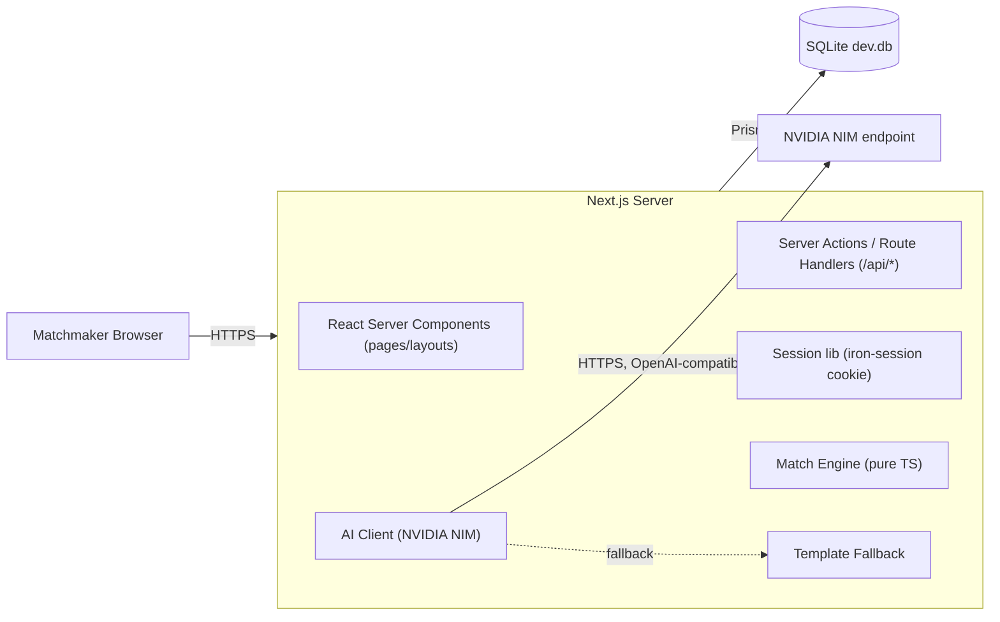

# 2. Technical Requirements Document (TRD)

**Project:** KnotWise — TDC Matchmaker Dashboard
**Companion to:** [`1-PRD.md`](1-PRD.md)
**Version:** 1.0

---

## 2.1 Tech stack (locked)

| Layer | Choice | Rationale |
|------|--------|-----------|
| Framework | **Next.js 15 (App Router)** | Single deploy, server actions and route handlers in one repo, fast to build the MVP |
| Language | **TypeScript (strict)** | Type-safe biodata schema across server + client |
| UI | **Tailwind CSS v4 + shadcn/ui + lucide-react** | Production-grade primitives, full ownership, no design-system lock-in |
| ORM / DB | **Prisma + SQLite** (dev & MVP) | Zero-config local DB, single `dev.db` file; trivial migration path to Postgres |
| Auth | **iron-session** (HTTP-only cookie sessions) | No third-party dependency, ~30 LOC to integrate, supports the simple username/password requirement |
| Validation | **Zod** | Shared schemas for API input and form validation |
| Forms | **React Hook Form + Zod resolver** | Standard combo, minimal boilerplate |
| LLM | **NVIDIA NIM** via OpenAI SDK (`baseURL = https://integrate.api.nvidia.com/v1`) | OpenAI-compatible; user-provided API key; free credits during dev |
| LLM fallback | Deterministic template engine | App never depends on a working network call |
| Tooling | ESLint, Prettier, `tsx` for seed scripts | Standard |
| Hosting | **Vercel** (recommended) | Native Next.js host; SQLite swapped for Vercel Postgres on deploy if needed |
| Package manager | **pnpm** | Faster, deterministic |

## 2.2 High-level architecture



- **No separate backend service.** All server logic lives in Next.js (Server Components, Server Actions, and `/api/*` route handlers).
- **Pure-function match engine** in `lib/matching/` — no I/O, fully unit-testable.
- **AI client** is a thin wrapper exposing `explainMatch()` and `draftIntroEmail()`. Both have a sync fallback.

## 2.3 Repository layout

```
knotwise/
  app/
    (auth)/login/page.tsx
    (app)/
      layout.tsx                    # protected layout (redirects if no session)
      dashboard/page.tsx            # customer list
      customers/[id]/
        page.tsx                    # detail (tabs)
        biodata/tab.tsx
        matches/tab.tsx
        notes/tab.tsx
    api/
      auth/login/route.ts
      auth/logout/route.ts
      customers/route.ts
      customers/[id]/route.ts
      customers/[id]/matches/route.ts
      customers/[id]/notes/route.ts
      matches/send/route.ts
      ai/explain/route.ts           # optional, mostly called server-side
      ai/intro-email/route.ts
  components/
    ui/                             # shadcn primitives
    customer-table.tsx
    biodata-card.tsx
    match-card.tsx
    send-match-modal.tsx
    notes-feed.tsx
  lib/
    auth/session.ts
    db.ts                           # Prisma client singleton
    matching/
      index.ts                      # rankMatches(customer, pool) entry point
      hard-filters.ts
      male-strategy.ts
      female-strategy.ts
      scoring.ts                    # weighted score helpers
      types.ts
    ai/
      client.ts                     # NVIDIA NIM wrapper
      explain.ts
      email.ts
      fallback.ts
      prompts.ts
  prisma/
    schema.prisma
    seed.ts                         # seeds matchmakers, customers, 120 pool profiles
  data/
    dummy-profiles.json             # generated by faker, checked in for reproducibility
  docs/                             # the 5 planning docs
  tests/
    matching.test.ts
  .env.example
  README.md
```

## 2.4 Functional requirements (server-side contracts)

All routes are protected (except `/api/auth/login`) and resolve the current matchmaker from the session cookie.

| Method | Path | Purpose | Auth |
|-------|------|---------|------|
| POST | `/api/auth/login` | username/password → set session cookie | public |
| POST | `/api/auth/logout` | clear session | required |
| GET  | `/api/customers` | list customers for current matchmaker | required |
| GET  | `/api/customers/:id` | one customer (must be assigned to current matchmaker) | required |
| GET  | `/api/customers/:id/matches?bucket=high\|all` | ranked matches with score + AI explanation | required |
| POST | `/api/customers/:id/notes` | `{ body: string }` → create note | required |
| POST | `/api/matches/send` | `{ customerId, candidateId, emailSubject, emailBody }` → log + mock-send | required |
| POST | `/api/ai/intro-email` | `{ customerId, candidateId }` → `{ subject, body }` (LLM or fallback) | required |

All responses use `application/json`. Errors follow `{ error: { code, message } }` with appropriate HTTP status.

## 2.5 Algorithms

### 2.5.1 Hard filters (applied first, both genders)

A candidate is rejected before scoring if any of:

1. Same gender as customer (or candidate not opposite gender per customer's preference)
2. Candidate is the customer themselves (id equality)
3. Religion mismatch AND customer's religion preference is `same religion only`
4. Diet hard incompatibility (e.g. strict vegetarian customer + non-veg candidate where customer prefers veg-only)
5. Marital status filter (e.g. `Never Married` customer who excludes `Divorced` candidates per preference — captured in partner preferences)
6. Candidate already sent to this customer (excluded from default list; toggleable)

Survivors pass to gender-specific scoring.

### 2.5.2 Matching algorithm (gender-aware, weighted)

Score is `0..100`, computed as a weighted sum of dimension sub-scores. Weights differ by client gender.

**Shared dimensions** (sub-score `0..1` each):

| Dimension | Computation |
|-----------|-------------|
| `religion` | 1.0 if same religion, 0.6 if customer is `Open to other religions`, else 0 |
| `motherTongue` | 1.0 if same, 0.7 if both speak a common language, else 0.4 |
| `caste` | 1.0 if same caste, 0.7 if same religion different caste, else 0.4 (downweighted in female strategy) |
| `diet` | 1.0 if compatible, 0.5 if adjacent (veg ↔ eggetarian), 0 if incompatible |
| `wantKids` | 1.0 if exact match, 0.5 if one is `Maybe`, 0 if `Yes` vs `No` |
| `relocate` | 1.0 if same city, else 1.0 if at least one is `Open to Relocate`, 0.4 if both `Maybe`, 0 if both `No` |
| `pets` | 1.0 same, 0.6 if one is `Maybe`, 0 if `Yes` vs `No` |
| `education` | 1.0 if same level, 0.8 if one tier apart, 0.5 if two tiers apart |
| `incomeBracket` | see strategies below |
| `ageDelta` | see strategies below |
| `heightDelta` | see strategies below |
| `manglik` | 1.0 if both compatible (both yes / both no / either don't-care), 0.3 otherwise |

**Male client → ranking women** (reflects brief: younger, earns less, shorter, aligned on kids):

| Weight | Dimension |
|-------:|-----------|
| 18 | `wantKids` |
| 14 | `religion` |
| 12 | `motherTongue` |
| 10 | `ageDelta` — peak at candidate 2–4 yrs younger, smooth fall off; 0 if candidate older than client |
| 8  | `heightDelta` — peak when candidate is 5–20 cm shorter; 0 if taller |
| 8  | `incomeBracket` — peak when candidate income ≤ client income; smooth taper above |
| 8  | `diet` |
| 7  | `caste` |
| 5  | `relocate` |
| 4  | `education` |
| 3  | `pets` |
| 3  | `manglik` |
| **100** | total |

**Female client → ranking men** (reflects brief: thoughtful, profession/values/relocation):

| Weight | Dimension |
|-------:|-----------|
| 16 | `wantKids` |
| 14 | `religion` |
| 12 | `motherTongue` |
| 12 | `education` — peak at same or one tier higher |
| 10 | `incomeBracket` — peak at similar or higher than client |
| 9  | `ageDelta` — peak at candidate 0–5 yrs older; -2 to +6 yr window |
| 8  | `relocate` |
| 6  | `diet` |
| 5  | `caste` |
| 4  | `heightDelta` — peak at 5–25 cm taller; soft penalty if shorter |
| 2  | `pets` |
| 2  | `manglik` |
| **100** | total |

> The two strategies live in `lib/matching/male-strategy.ts` and `lib/matching/female-strategy.ts` and export a single `score(client, candidate): { total, breakdown }` function. Easy to A/B test or replace.

**Bucketing**
- `>= 75` → "High Potential"
- `55–74` → "Worth Considering"
- `< 55` → "Low Fit" (hidden by default, accessible via toggle)

### 2.5.3 AI layer

`lib/ai/client.ts` exposes:

```ts
export async function complete(
  messages: ChatMessage[],
  opts?: { temperature?: number; maxTokens?: number }
): Promise<string>
```

Implementation:

1. If `process.env.NVIDIA_NIM_API_KEY` is set, call NVIDIA NIM with the OpenAI SDK:
   ```ts
   new OpenAI({
     apiKey: process.env.NVIDIA_NIM_API_KEY,
     baseURL: "https://integrate.api.nvidia.com/v1",
   });
   ```
   Default model: `meta/llama-3.3-70b-instruct` (configurable via `NVIDIA_NIM_MODEL`).
2. Wrap in a 6-second timeout + 1 retry.
3. On any error → return `null` and let caller use fallback.

**`explainMatch(client, candidate, breakdown)`**
- LLM is given a JSON of the two profiles and the dimension breakdown.
- Prompt asks for ONE sentence (≤ 30 words), neutral tone, citing the 2 strongest dimensions.
- Fallback: builds a sentence from the top-2 dimensions and their sub-scores (template in `lib/ai/fallback.ts`).

**`draftIntroEmail(client, candidate)`**
- LLM is asked for a warm ~120-word email *from the matchmaker to the client*, introducing the candidate.
- Returns `{ subject, body }`.
- Fallback: a clean template using {client.firstName, candidate.firstName, candidate.city, candidate.profession, …}.

System prompts and few-shot examples live in `lib/ai/prompts.ts` so a content reviewer can audit them without touching code.

## 2.6 Non-functional requirements

| | |
|---|---|
| **Performance** | Customer list < 300 ms server render; matches tab < 1.5 s (AI explanations parallelised with `Promise.all`, top 12 only) |
| **Concurrency** | LLM calls batched in groups of 5 to respect rate limits |
| **Resilience** | Every AI call falls back deterministically; no UI shows a "service down" error |
| **Security** | Passwords hashed with bcrypt (`$2b$10$`); sessions via signed HTTP-only `secure` cookie; CSRF via SameSite=Lax + state-changing routes require POST; matchmaker-scoped queries enforce ownership server-side (`where: { matchmakerId: session.matchmakerId }`) |
| **Privacy** | API keys read only from env; PII never logged; LLM prompts redact phone and email by default |
| **Accessibility** | All interactive elements keyboard-accessible; semantic HTML; WCAG AA contrast (shadcn defaults) |
| **Browser support** | Latest 2 versions of Chrome, Safari, Edge, Firefox |
| **Code quality** | `pnpm typecheck && pnpm lint && pnpm test` must pass; modular files < 300 LOC; matching engine has unit tests for every dimension and both strategies |

## 2.7 Environment variables

`.env.example`:

```
# Session
SESSION_SECRET=replace_with_32_byte_random_string

# Database
DATABASE_URL="file:./prisma/dev.db"

# AI (NVIDIA NIM)
NVIDIA_NIM_API_KEY=
NVIDIA_NIM_MODEL=meta/llama-3.3-70b-instruct
NVIDIA_NIM_BASE_URL=https://integrate.api.nvidia.com/v1

# App
APP_URL=http://localhost:3000
```

`NVIDIA_NIM_API_KEY` is optional at boot — the app starts and runs with the template fallback if it's missing, and prints a single startup warning.

## 2.8 Testing strategy (MVP-appropriate)

- **Unit:** `lib/matching/*` — one test per dimension and one full-strategy test per gender, using fixture profiles
- **Smoke:** a script that boots the app, logs in, walks Dashboard → Customer → Matches → Send Match, asserts 200s
- **AI fallback:** force `NVIDIA_NIM_API_KEY=""` in test env and assert `explainMatch` and `draftIntroEmail` still return non-empty strings

Out of scope for MVP: full E2E with Playwright, visual regression, load testing.

## 2.9 Deployment

- Local: `pnpm dev` — SQLite file, seeded via `pnpm db:seed`
- Vercel: same repo; for production, swap `DATABASE_URL` to Vercel Postgres and run `prisma migrate deploy`. The Prisma schema is portable.
- `NVIDIA_NIM_API_KEY` set as a Vercel environment variable.
