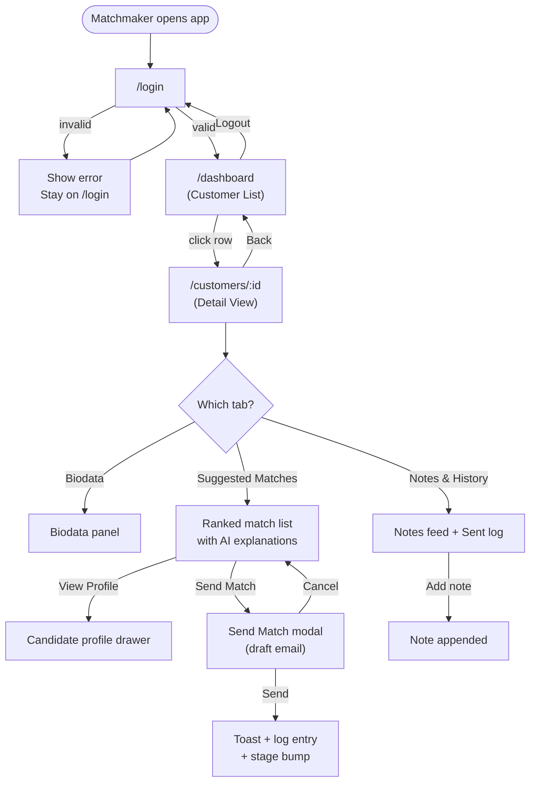
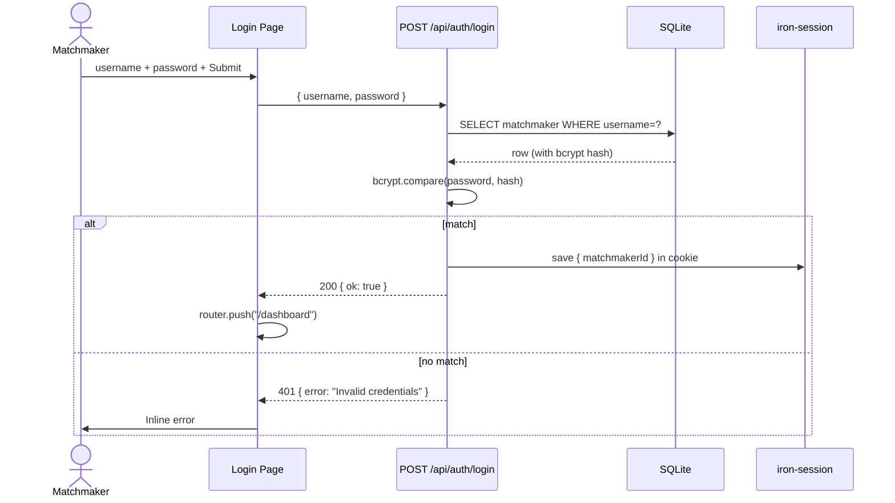
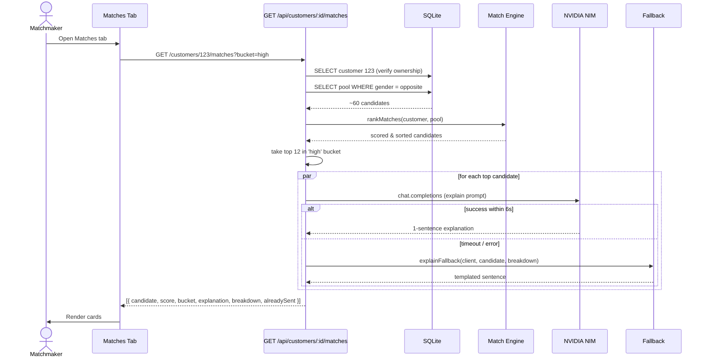
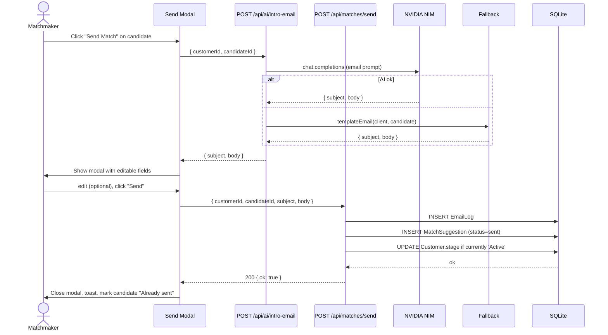
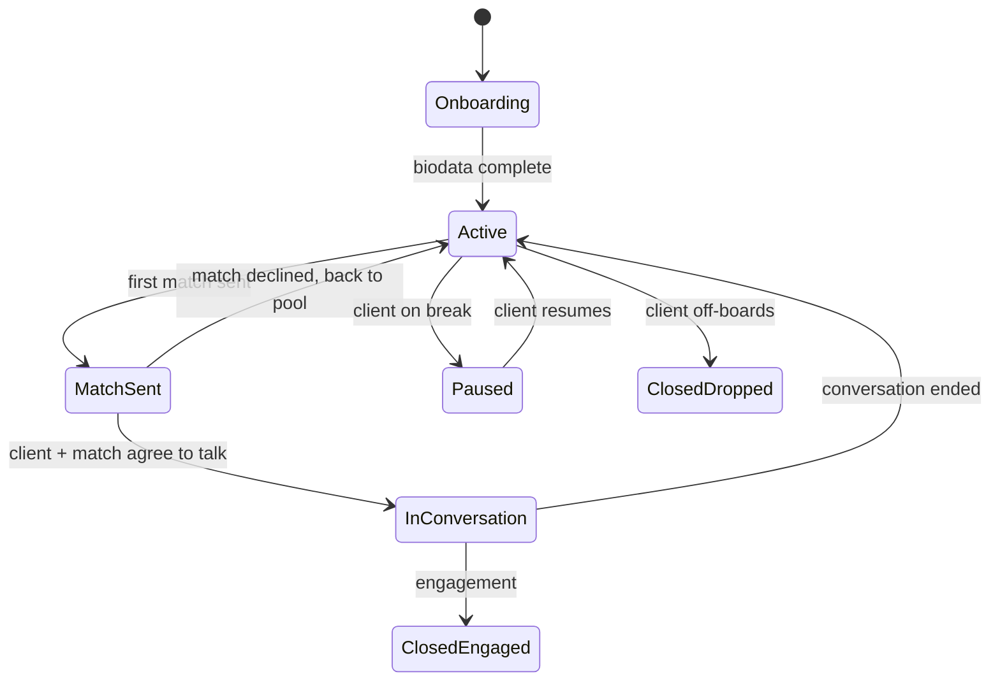
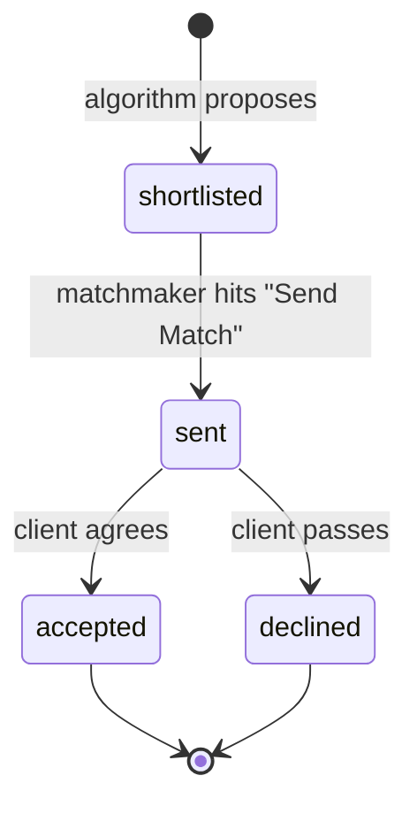

# 3. Application Flow

**Project:** KnotWise — TDC Matchmaker Dashboard
**Companion to:** [`1-PRD.md`](1-PRD.md), [`2-TRD.md`](2-TRD.md)
**Version:** 1.0

---

## 3.1 Top-level user journey



## 3.2 Page-by-page specification

### 3.2.1 `/login`

- Centered card. Logo + "TDC Matchmaker".
- Fields: username, password. Submit → `POST /api/auth/login`.
- Success → redirect to `/dashboard`.
- Failure → inline error "Incorrect username or password."
- If a valid session cookie exists, this page redirects straight to `/dashboard`.

### 3.2.2 `/dashboard`

Header: matchmaker's name + avatar initials + Logout.

Body:
- Page title: "My Customers"
- Filter bar: search input (name), stage multiselect, city dropdown
- Table:

| Photo | Name | Age | City | Marital | Stage | Last Activity |
|-------|------|----:|------|---------|-------|---------------|

Row click → `/customers/:id`.

Empty state: "No customers assigned yet. Contact ops to get profiles assigned."

### 3.2.3 `/customers/:id`

Header strip: photo, full name, age, city, current stage (editable dropdown), back-to-dashboard.

Three-tab interface:

#### Tab A: Biodata
Sections (collapsible):
1. **Personal** — name, gender, DOB/age, height, mother tongue, marital status
2. **Location** — country, city, open-to-relocate
3. **Education & Career** — degree, college, current company, designation, income
4. **Family** — father's/mother's occupation, siblings, family type
5. **Religion & Community** — religion, caste, sub-caste, gotra, manglik
6. **Lifestyle** — diet, smoking, drinking, want kids, open to pets
7. **About** — bio paragraph
8. **Contact** — email, phone (masked unless "Reveal" clicked)
9. **Partner preferences** — preferred age range, height range, religion, cities

#### Tab B: Suggested Matches

- Default view = `High Potential` bucket (score ≥ 75)
- Toggle: `High Potential` | `Worth Considering` | `All`
- Cards (one per candidate):

```
┌─────────────────────────────────────────────────────────────────────┐
│ [photo]  Priya Iyer · 28 · Bangalore · Software Engineer at Stripe  │
│          Score: 87  ●●●●●●●●○○   "High Potential Match"             │
│          "Both vegetarian Tamil speakers in Bangalore tech;          │
│           aligned on wanting 2 kids; 3 yrs younger and similar       │
│           income bracket."                                           │
│                                       [View Profile]  [Send Match]  │
│                                       [Already sent ✓ on Apr 12]    │
└─────────────────────────────────────────────────────────────────────┘
```

- Dimension breakdown is hidden behind a "Why this score?" expander showing the per-dimension sub-scores.

#### Tab C: Notes & History

- Add-note composer (textarea + "Add note")
- Newest-first feed of notes (timestamp, matchmaker name, body)
- Below: "Matches Sent" log — chronological list of candidates sent

### 3.2.4 Send Match modal

Triggered from the Suggested Matches tab. Contents:

- Title: "Send Match: Priya Iyer → Rahul Sharma"
- Editable Subject field (pre-filled by AI/fallback)
- Editable Body textarea (pre-filled by AI/fallback)
- Footer: "Cancel" · "Send" (primary)

Clicking Send:
1. `POST /api/matches/send` with `{ customerId, candidateId, subject, body }`
2. Server logs to `EmailLog` + creates `MatchSuggestion` (status `sent`) + bumps customer stage if `Active`
3. Modal closes, success toast "Match sent to Priya."
4. The candidate card now shows "Already sent ✓".

## 3.3 Sequence diagrams

### 3.3.1 Login



### 3.3.2 Load suggested matches (with AI explanations)



### 3.3.3 Send Match



## 3.4 State diagrams

### 3.4.1 Customer journey stage



In MVP, all transitions are manual via the dropdown on the customer detail header, except `Active → MatchSent` which happens automatically on first Send Match.

### 3.4.2 MatchSuggestion lifecycle (post-MVP, captured for schema completeness)



MVP only writes `shortlisted` and `sent`. The remaining statuses are stub values to avoid a schema migration later.

## 3.5 Error & empty states (every screen has one)

| Screen | Loading | Empty | Error |
|--------|---------|-------|-------|
| Login | spinner on button | n/a | inline "Incorrect username or password" |
| Dashboard | skeleton rows | "No customers assigned yet" | "Could not load customers. Retry" |
| Customer detail | skeleton | n/a (404 if not owned) | "Could not load this customer" |
| Suggested matches | skeleton cards (5) | "No matches above the High Potential threshold. Try 'Worth Considering' or 'All'." | "Could not load matches. Retry" |
| Notes | skeleton | "No notes yet. Add the first one." | "Could not save note. Retry" |
| Send Match | skeleton on body field while LLM drafts | n/a | "Couldn't reach the AI; using a template" (non-blocking banner inside modal) |

## 3.6 Auth + routing rules

- All `/app/(app)/*` routes are wrapped in a server-side guard: read session cookie, if no matchmaker → redirect to `/login`.
- All `/api/*` routes (except `/api/auth/login`) start with `const session = await getSession(); if (!session) return 401`.
- Every read of customer/match/note enforces `where: { matchmakerId: session.matchmakerId }`. A matchmaker hitting `/customers/<id-of-someone-elses-client>` gets a 404.
