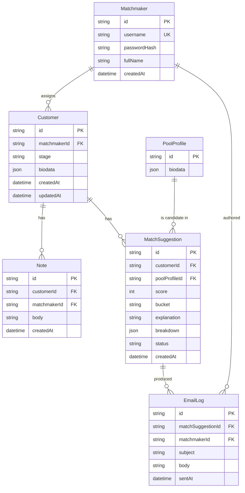

# 4. Backend Schema

**Project:** KnotWise — TDC Matchmaker Dashboard
**Companion to:** [`2-TRD.md`](2-TRD.md)
**Version:** 1.0

---

## 4.1 Overview

Single SQLite database, accessed via Prisma. Six tables:



Both `Customer.biodata` and `PoolProfile.biodata` use a **typed JSON column** (Prisma `Json`). Rationale: the biodata has 30+ fields that are read together but rarely queried individually; storing as JSON keeps the schema small and lets the field set evolve without migrations. The few fields we *do* filter/sort on (gender, city, age via DOB) are duplicated into top-level columns for indexability.

## 4.2 Prisma schema (`prisma/schema.prisma`)

```prisma
// schema.prisma
generator client {
  provider = "prisma-client-js"
}

datasource db {
  provider = "sqlite"
  url      = env("DATABASE_URL")
}

model Matchmaker {
  id           String   @id @default(cuid())
  username     String   @unique
  passwordHash String
  fullName     String
  createdAt    DateTime @default(now())

  customers Customer[]
  notes     Note[]
  emails    EmailLog[]
}

model Customer {
  id           String   @id @default(cuid())
  matchmakerId String
  matchmaker   Matchmaker @relation(fields: [matchmakerId], references: [id])

  firstName     String
  lastName      String
  gender        String   // "male" | "female"
  dateOfBirth   DateTime
  city          String
  country       String
  maritalStatus String

  stage         String   @default("Onboarding")
  biodata       Json     // full Biodata object (see 4.4)
  photoUrl      String?

  createdAt DateTime @default(now())
  updatedAt DateTime @updatedAt

  notes        Note[]
  suggestions  MatchSuggestion[]

  @@index([matchmakerId])
  @@index([stage])
  @@index([gender])
}

model PoolProfile {
  id          String   @id @default(cuid())
  firstName   String
  lastName    String
  gender      String
  dateOfBirth DateTime
  city        String
  country     String
  biodata     Json
  photoUrl    String?

  suggestions MatchSuggestion[]

  @@index([gender])
  @@index([city])
}

model MatchSuggestion {
  id            String   @id @default(cuid())
  customerId    String
  poolProfileId String

  customer    Customer    @relation(fields: [customerId], references: [id])
  poolProfile PoolProfile @relation(fields: [poolProfileId], references: [id])

  score       Int
  bucket      String   // "high" | "medium" | "low"
  explanation String   // 1-sentence AI/fallback
  breakdown   Json     // { religion: 1.0, motherTongue: 0.7, ... }
  status      String   @default("shortlisted") // shortlisted|sent|accepted|declined

  createdAt DateTime @default(now())

  emails EmailLog[]

  @@unique([customerId, poolProfileId])
  @@index([customerId, status])
}

model Note {
  id           String   @id @default(cuid())
  customerId   String
  matchmakerId String
  body         String

  createdAt DateTime @default(now())

  customer   Customer   @relation(fields: [customerId], references: [id])
  matchmaker Matchmaker @relation(fields: [matchmakerId], references: [id])

  @@index([customerId, createdAt])
}

model EmailLog {
  id                String   @id @default(cuid())
  matchSuggestionId String
  matchmakerId      String

  subject String
  body    String
  sentAt  DateTime @default(now())

  matchSuggestion MatchSuggestion @relation(fields: [matchSuggestionId], references: [id])
  matchmaker      Matchmaker      @relation(fields: [matchmakerId], references: [id])

  @@index([matchmakerId, sentAt])
}
```

## 4.3 TypeScript types (shared, `lib/types.ts`)

```ts
export type Gender = "male" | "female";

export type Trinary = "Yes" | "No" | "Maybe";

export type Diet =
  | "Vegetarian"
  | "Eggetarian"
  | "Non-vegetarian"
  | "Vegan"
  | "Jain";

export type Frequency = "Never" | "Occasionally" | "Regularly";

export type MaritalStatus = "Never Married" | "Divorced" | "Widowed" | "Separated";

export type EducationLevel =
  | "High School"
  | "Bachelor's"
  | "Master's"
  | "PhD"
  | "Professional"; // MBBS, CA, etc.

export type Stage =
  | "Onboarding"
  | "Active"
  | "Match Sent"
  | "In Conversation"
  | "Paused"
  | "Closed - Engaged"
  | "Closed - Dropped";

export interface PartnerPreferences {
  ageMin?: number;
  ageMax?: number;
  heightMinCm?: number;
  heightMaxCm?: number;
  religions?: string[];          // empty = open
  motherTongues?: string[];
  cities?: string[];
  educationMin?: EducationLevel;
  acceptsManglik?: "Yes" | "No" | "Doesn't matter";
  acceptedMaritalStatuses?: MaritalStatus[];
}

export interface Biodata {
  // Personal
  firstName: string;
  lastName: string;
  gender: Gender;
  dateOfBirth: string;           // ISO date
  heightCm: number;
  motherTongue: string;
  maritalStatus: MaritalStatus;

  // Location
  country: string;
  city: string;
  openToRelocate: Trinary;

  // Contact
  email: string;
  phone: string;

  // Education & Career
  educationLevel: EducationLevel;
  undergradCollege: string;
  degree: string;
  currentCompany: string;
  designation: string;
  annualIncomeINR: number;

  // Family
  fathersOccupation?: string;
  mothersOccupation?: string;
  siblings: number;
  familyType: "Nuclear" | "Joint";

  // Religion & community
  religion: string;
  caste: string;
  subCaste?: string;
  gotra?: string;
  manglik: "Yes" | "No" | "Don't know" | "Doesn't matter";

  // Lifestyle
  diet: Diet;
  smoking: Frequency;
  drinking: Frequency;
  wantKids: Trinary;
  openToPets: Trinary;
  languagesKnown: string[];

  // Free text
  bio?: string;

  // Preferences for partner
  partnerPreferences: PartnerPreferences;

  // Optional UI
  photoUrl?: string;
}

export interface ScoredCandidate {
  candidate: Biodata & { id: string };
  score: number;                 // 0..100
  bucket: "high" | "medium" | "low";
  explanation: string;
  breakdown: Record<string, number>;
  alreadySent: boolean;
}
```

## 4.4 Seed strategy (`prisma/seed.ts`)

1. **Matchmakers (3)** — `riya/password123`, `arjun/password123`, `ops/password123`. Passwords bcrypt-hashed.
2. **Pool profiles (120)** — 60 male + 60 female, generated by `@faker-js/faker` with Indian-locale weighting:
   - Names drawn from a curated list of common Indian first names per gender + common surnames
   - Cities weighted toward Bangalore, Mumbai, Delhi, Pune, Hyderabad, Chennai
   - Religions weighted Hindu 70 / Muslim 12 / Christian 6 / Sikh 5 / Jain 4 / Other 3
   - Mother tongues correlated with city / religion realistically
   - Ages 24–38, heights 150–185 cm
   - Incomes log-normal-ish, 4L–60L INR
3. **Customers (~8 per matchmaker)** — drawn the same way; assigned across `Onboarding/Active/Match Sent/Paused` to make the dashboard non-empty
4. **Faker is seeded with a fixed seed** (`faker.seed(42)`) so the same data is generated every run — reproducible demos and tests.
5. The generated pool is also written to `data/dummy-profiles.json` so it can be inspected / version-controlled.

Seed is idempotent: it deletes all rows from all tables (in FK-safe order) before inserting.

## 4.5 API contracts (request/response shapes)

`POST /api/auth/login`
```ts
// req
{ username: string; password: string }
// res 200
{ ok: true; matchmaker: { id: string; fullName: string } }
// res 401
{ error: { code: "INVALID_CREDENTIALS"; message: string } }
```

`GET /api/customers` → `Array<CustomerListItem>`
```ts
interface CustomerListItem {
  id: string;
  firstName: string;
  lastName: string;
  age: number;
  city: string;
  maritalStatus: MaritalStatus;
  stage: Stage;
  photoUrl?: string;
  lastActivityAt: string;        // max(updatedAt, last note, last email)
}
```

`GET /api/customers/:id` → `{ customer: Biodata & { id, stage, createdAt, updatedAt } }`

`GET /api/customers/:id/matches?bucket=high|medium|all&limit=12`
→ `{ items: ScoredCandidate[] }`

`POST /api/customers/:id/notes`
```ts
// req
{ body: string }                 // 1..2000 chars
// res 200
{ note: { id, body, createdAt, matchmakerName } }
```

`POST /api/ai/intro-email`
```ts
// req
{ customerId: string; candidateId: string }
// res 200
{ subject: string; body: string; source: "llm" | "fallback" }
```

`POST /api/matches/send`
```ts
// req
{ customerId: string; candidateId: string; subject: string; body: string }
// res 200
{ ok: true; suggestionId: string; emailId: string; stageBumped: boolean }
```

## 4.6 Invariants & integrity rules

- A `MatchSuggestion` row is unique per `(customerId, poolProfileId)` — preventing duplicate shortlists.
- `EmailLog` always references an existing `MatchSuggestion` with `status='sent'`.
- All write endpoints verify the `customerId` belongs to `session.matchmakerId` before any DB write.
- Notes are append-only (no UPDATE/DELETE exposed in MVP).
- `Customer.stage` transitions are validated server-side against the state diagram in [§3.4.1](3-Application-Flow.md#341-customer-journey-stage).

## 4.7 Migration path

For production:

1. Change `provider = "sqlite"` → `"postgresql"` in `schema.prisma`.
2. `DATABASE_URL` → Postgres connection string.
3. `prisma migrate deploy`.
4. Re-run seed against the new DB.

The `Json` columns work identically across SQLite and Postgres in Prisma, so no application code changes.
